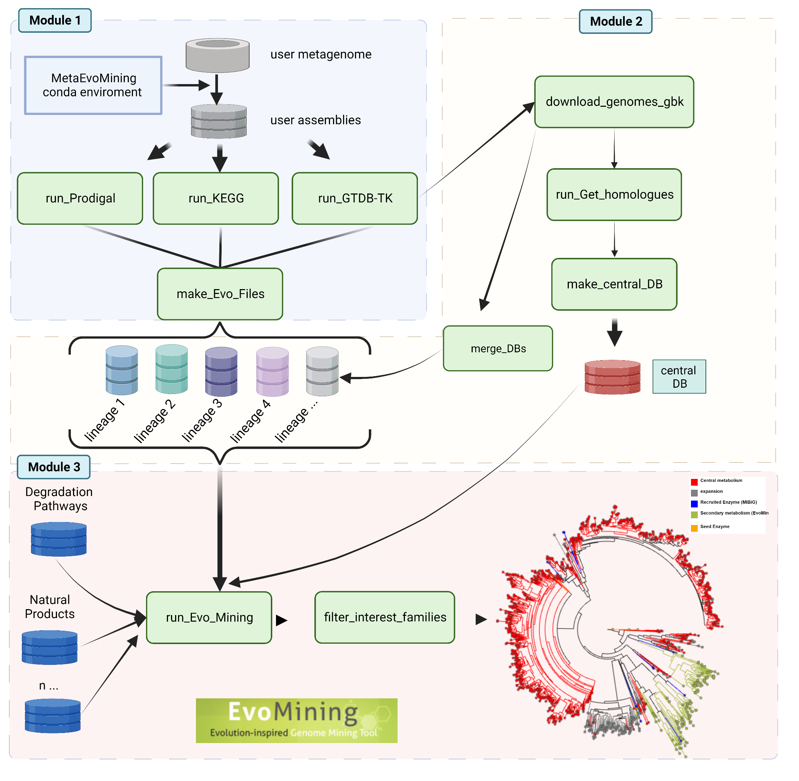
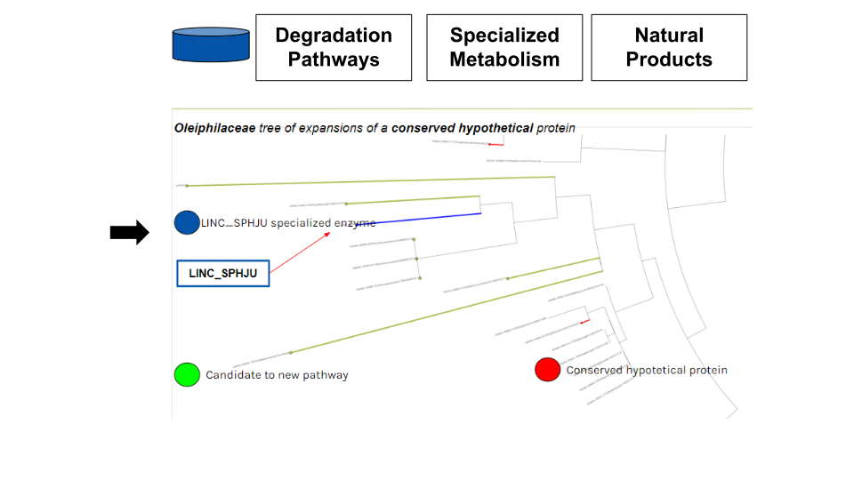

# MetaEvoMining

### *Acknowledgments*
I would like to thank the PAPIIT IA106323 project Pan-cluster, Big Data tools for the pangenomic characterization of biosynthetic clusters in microorganisms for providing the funding to carry out this project. I also appreciate the Bioinformatics Laboratory at CCM-UNAM for providing us with the necessary resources and Dr. Mirna Vázquez for providing us with the data to work with.
### *Agradecimientos*
Quiero agradecer al proyecto PAPIIT IA106323 Pan-cluster, herramientas de Big Data para caracterización pangenómica de clústeres biosintéticos en microorganismos por brindarnos el financiamiento para llevar a cabo este proyecto. También agradezco al Laboratorio de Bioinformática del CCM por proporcionarnos los recursos necesarios y a la Dra. Mirna Vázquez por facilitarnos los datos para trabajar.


## What is MetaEvoMining?

MetaEvoMining is a tool for the exploration of unknown enzymes using an
evolutionary approach. MetaEvoMining detects, through sequence homology,
those genes that have undergone expansion and identifies potential
candidates for enzymes recruited through natural selection for new/novel
biosynthetic pathways. MetaEvoMining searches for differences among
homologous sequences from organisms that share a common evolutionary
lineage.



# Quick Start

## Installation

-----------------------------------------------------------------------

This package is setting in [github](https://github.com/andrespan/MetaEvoMining.git).

Before installing it, you need to do the following:

1. You need to install devtools first.

```{r}

install.packages("devtools")
```

2. Once devtools is installed, we need to load it

```{r}

library(devtools)
```

3. Then you can install the MetaEvoMining package with install_packages

```{r}

install_github("andrespan/MetaEvoMining")

```

## Module 1(optional)

------------------------------------------------------------------------

**\|Get a central Database\|** We can create a database in two steps. The
first is the search for orthologous sequences by get_homologues.

```{r}

#run_get_homologs

```

The second searches from the directories resulting sequences that are
present in more than half of the database, and groups them in a database
ready to use in the program.

-   The **csv_matrix** is a pangenome matrix that results from
    [get_homologs](http://eead-csic-compbio.github.io/get_homologues/manual/)

-   The **path** is the output directory of alg_intersection of
    [get_homologs](http://eead-csic-compbio.github.io/get_homologues/manual/)

```{r}

search_shell_enzymes_DB("pangenome_matrix_t0.tr.csv",path)

```

## Module 2

------------------------------------------------------------------------

**\|Get the EvoMining files\|** This module takes protein assemblies and
generates a functional annotation table and sequence file to run
EvoMining.

-   The **annotation_dirpath** is the path of annotation output
    directory created by
    [KofamScan](https://github.com/takaram/kofam_scan.git).
-   The **genome_dirpath** is the path of all FASTA protein files of all
    the bins.
-   The **gtdbK_report** is a tsv file wich was create by
    [gtdbtk](https://github.com/Ecogenomics/GTDBTk.git) program.

```{r}

make_EvoFiles(annotation_dirpath,
                          genome_dirpath,
                          IDs_table)

```

## Module 3

------------------------------------------------------------------------
**\|Run EvoMining trees\|** This module runs EvoMining with the files resulting from the previous module. You can use the central database generated in module 1 or any database created with the [EvoMining guidelines.](https://github.com/nselem/evomining/wiki/Databases-Conformation)

This function generates a table that reports the copy counts in the enzyme families.

```{r}

#run_EvoMining

```

The generated table can be filtered with the following function. This function searches the EvoMining table and looks for columns (enzymes) where the counts in the input genomes are above the mode. It reports those columns in a list to run the trees.

- The **EvoMinining_heat_table** is a copy count table where the columns are the enzyme families and the rows are the input genomes.

```{r}

filter_interest_families(EvoMinining_heat_table)

```


After that you can run the selected trees in the list and observe the predictions. Each branch has the id of the sequence so you can search it.

```{r}

#run_trees

```


