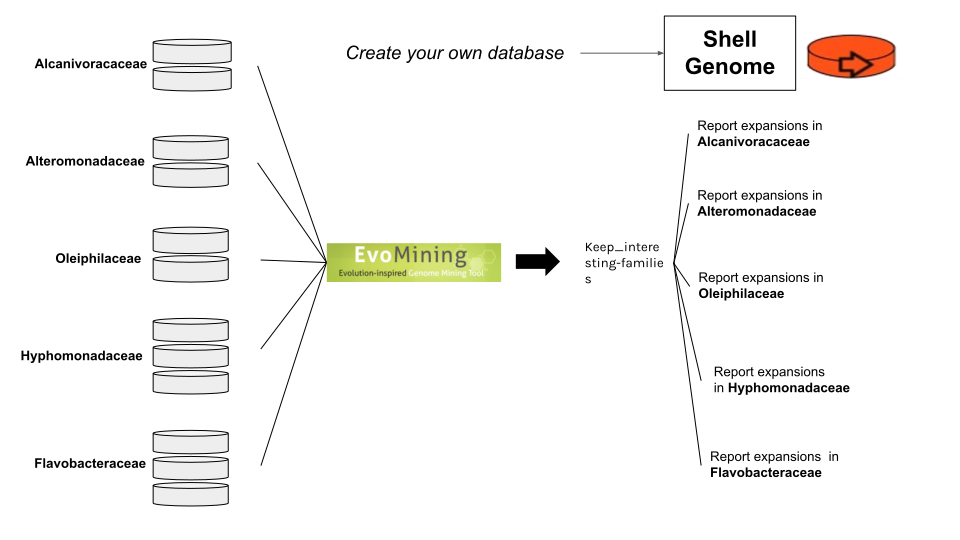

# MetaEvoMining

## What is MetaEvoMining?

MetaEvoMining is a tool for the exploration of unknown enzymes using an
evolutionary approach. MetaEvoMining detects, through sequence homology,
those genes that have undergone expansion and identifies potential
candidates for enzymes recruited through natural selection for new/novel
biosynthetic pathways. MetaEvoMining searches for differences among
homologous sequences from organisms that share a common evolutionary
lineage.



# Quick Start

## Module 1(optional)

------------------------------------------------------------------------

**\|Get a central Database\|** We can create a database from two steps. The
first is the search for orthologous sequences by get_homologues.

```{r}

#run_get_homologs

```

The second searches from the directories resulting sequences that are
present in more than half of the database, and groups them in a database
ready to use in the program.

-   The **csv_matrix** is a pangenome matrix that results from
    [get_homologs](http://eead-csic-compbio.github.io/get_homologues/manual/)

-   The **path** is the output directory of alg_intersection of
    get_homologs

```{r}

search_shell_enzymes_DB("pangenome_matrix_t0.tr.csv",path)

```

## Module 2

------------------------------------------------------------------------

**\|Get the EvoMining files\|** This module takes protein assemblies and
generates a functional annotation table and sequence file to run
EvoMining.

-   The **annotation_dirpath** is the path of annotation output
    directory created by
    [KofamScan](https://github.com/takaram/kofam_scan.git).
-   The **genome_dirpath** is the path of all FASTA protein files of all
    the bins.
-   The **gtdbK_report** is a tsv file wich was create by
    [gtdbtk](https://github.com/Ecogenomics/GTDBTk.git) program.

```{r}

make_EvoFiles(annotation_dirpath,
                          genome_dirpath,
                          IDs_table)

```

## Module 3

------------------------------------------------------------------------

